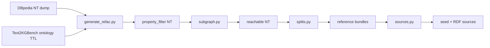

# KGI-Bench Data Generation

This document describes how to build **domain-specific KGI-Bench** (Knowledge Graph Integration Benchmark) datasets from **DBpedia** data and **Text2KGBench subontologies**.

The pipeline lives in [`resources/text2kgbench/`](../resources/text2kgbench/) and produces overlapping multi-source benchmark bundles in the same style as the movie-KG integration benchmark: a hidden reference graph per split, plus shaded seed and RDF source graphs for integration evaluation.

## Overview



| Step | Script | Input | Output |
|------|--------|-------|--------|
| 1 | `generate_refac.py` | Full DBpedia dump + ontology TTL | Property- and class-filtered subgraph |
| 2 | `subgraph.py` | Property-filtered NT | Class-rooted reachable subgraph |
| 3 | `splits.py` | Reachable NT | Overlapping splits with reference KGs |
| 4 | `sources.py` | Splits directory | Shaded seed and RDF source graphs |

Run scripts from the repository root with `uv run resources/text2kgbench/<script>.py ...`, or `cd resources/text2kgbench` and use the shorter paths shown in examples below.

## Prerequisites

- **DBpedia dump** as N-Triples (`.nt` or `.nt.bz2`). A pre-filtered dump such as `selected.nt.bz2` from the DBpedia multi-source KG pipeline works well as input.
- **Text2KGBench ontology** in Turtle (`.ttl`). Ontologies map OWL classes and properties to DBpedia URIs via `owl:equivalentClass` / `owl:equivalentProperty`. They are typically named like `13_food_ontology.ttl`.
- **Java 17** for local Spark runs (`sdk use java 17.0.16-tem` or equivalent).
- **Python environment** managed with `uv` from the ODIBEL project root.

### Available Text2KGBench ontologies

| ID | Domain |
|----|--------|
| 1 | University |
| 2 | Musical work |
| 3 | Airport |
| 4 | Building |
| 5 | Athlete |
| 6 | Politician |
| 7 | Company |
| 8 | Celestial body |
| 9 | Astronaut |
| 10 | Comics character |
| 11 | Mean of transportation |
| 12 | Monument |
| 13 | Food |
| 14 | Written work |
| 15 | Sports team |
| 16 | City |
| 17 | Artist |
| 18 | Scientist |
| 19 | Film |

For each domain, choose the **primary DBpedia class** as the root/main class (e.g. `dbo:Food` for ontology 13, `dbo:WrittenWork` for ontology 14). This class is used in steps 2 and 3.

## Step 1 — Ontology-driven property filtering (`generate_refac.py`)

[`generate_refac.py`](../resources/text2kgbench/generate_refac.py) reads a Text2KGBench ontology and extracts DBpedia classes and properties. It then filters a DBpedia dump to:

1. Triples whose predicate is in the ontology property set (plus `rdf:type` and `rdfs:label`).
2. Entities whose types fall within the ontology class set.

**Usage:**

```bash
uv run resources/text2kgbench/generate_refac.py \
  <input_path> \
  <output_path> \
  <ontology_path> \
  [name_prefix]
```

**Example (food domain, local paths):**

```bash
uv run resources/text2kgbench/generate_refac.py \
  file://./data/dbpedia-multi-source-kg-data/selected.nt.bz2 \
  ./data/text2kgbench/subgraphs \
  ./data/text2kgbench/kgpipe-ontologies/dbpedia_webnlg/13_food_ontology.ttl
```

If `name_prefix` is omitted, it is derived from the ontology filename (e.g. `13_food_ontology.ttl` → `ont_13`).

**Outputs** under `<output_path>/<name_prefix>_subgraph/`:

| File | Description |
|------|-------------|
| `property_filter/` | Filtered N-Triples (Spark `part-*` text files) |
| `property_filter_schema/` | CSV schema graph derived from the filtered triples |

Existing outputs are skipped on re-run. When using the in-memory engine in later steps, merge `property_filter/part-*` into a single `.nt` file first (see step 2).

## Step 2 — Reachable subgraph extraction (`subgraph.py`)

[`subgraph.py`](../resources/text2kgbench/subgraph.py) takes the property-filtered graph and extracts the **class-rooted reachable subgraph**. Starting from all entities of the root class (e.g. `dbo:Food`), it follows resource edges to include indirectly connected entities (cities, countries, etc.) and keeps all triples whose subject is in that reachable set.

**Optional preprocessing:** For English-only benchmarks, strip non-`@en` language tags from literals before this step:

```bash
cat property_filter/* \
  | grep -Pv '@(?!en\b)[a-z]+' \
  > property_filter_clean.nt
```

**Usage:**

```bash
uv run resources/text2kgbench/subgraph.py \
  <input_path> \
  <output_path> \
  --root-class <dbo:Class or full URI> \
  [--engine memory|spark] \
  [--max-hops N] \
  [--direction forward|backward|both]
```

**Example:**

```bash
uv run resources/text2kgbench/subgraph.py \
  ./data/text2kgbench/subgraphs/ont_13_subgraph/property_filter_clean.nt \
  ./data/text2kgbench/subgraphs/ont_13_subgraph/reachable.nt \
  --root-class dbo:Food \
  --engine memory
```

- **`--engine memory`** (default): in-process adjacency traversal; suitable for medium graphs on a single machine.
- **`--engine spark`**: distributed traversal via `rDF2` on Spark; use for large graphs or cluster runs.

The output path must not already exist.

## Step 3 — Overlapping splits and reference graphs (`splits.py`)

[`splits.py`](../resources/text2kgbench/splits.py) builds **overlapping entity splits** in the movie-KG style. It samples seed entities from the main class, creates several subsets with controlled overlap, and writes a **reference knowledge graph** per split by reachability expansion from each seed set.

**Usage:**

```bash
uv run resources/text2kgbench/splits.py \
  <input_path> \
  <output_dir> \
  --main-class <dbo:Class or full URI> \
  --subset-size <N> \
  [--num-subsets 4] \
  [--overlap-ratio 0.04] \
  [--engine memory|spark] \
  [--main-class-scope reachable|seeds] \
  [--max-hops N] \
  [--seed 42]
```

**Example:**

```bash
uv run resources/text2kgbench/splits.py \
  ./data/text2kgbench/subgraphs/ont_14_subgraph/reachable.nt \
  ./data/text2kgbench/splits/ont_14_writtenwork \
  --main-class dbo:WrittenWork \
  --num-subsets 4 \
  --overlap-ratio 0.04 \
  --subset-size 2500 \
  --engine memory
```

**Key parameters:**

- **`--subset-size`**: number of main-class seed entities per split (required).
- **`--overlap-ratio`**: target fraction of shared seeds between split pairs (default `0.04`).
- **`--main-class-scope`**:
  - `reachable` (default): reference subgraph includes all entities reachable from seeds.
  - `seeds`: only seed main-class entities are kept in the induced subgraph.

**Output layout:**

```
<output_dir>/
  entities/master_entities.csv          # all main-class entities in input
  split_0/
    index/entities.csv                  # seed entities for this split
    kg/reference/
      data.nt                           # per-split reference graph
      data_agg.nt                       # cumulative reference (splits 0..N)
      meta/verified_entities.csv
  split_1/
    ...
```

The output directory must not already exist. The script prints seed and subgraph overlap statistics on completion.

## Step 4 — Shaded source graphs (`sources.py`)

[`sources.py`](../resources/text2kgbench/sources.py) derives **integration sources** from the reference bundles produced by `splits.py`. It rewrites entity and ontology URIs into shaded namespaces (same approach as [`resources/movie-multi-source-kg/generate.py`](../resources/movie-multi-source-kg/generate.py)):

| Output | Namespace pattern | Role |
|--------|-------------------|------|
| `split_N/kg/seed/data.nt` | `http://kg.org/resource/{md5}` | Seed KG source |
| `split_N/sources/rdf/data.nt` | `http://kg.org/rdf/N/...` | Split-scoped RDF source |

**Usage:**

```bash
uv run resources/text2kgbench/sources.py <splits_dir> [--split N] [--overwrite]
```

**Example:**

```bash
uv run resources/text2kgbench/sources.py \
  ./data/text2kgbench/splits/ont_14_writtenwork
```

Each split also gets `meta/verified_entities.csv` under `kg/seed/` and `sources/rdf/`.

## End-to-end example (ontology 13 — Food)

```bash
# 1. Filter DBpedia by ontology classes and properties (Spark; writes a part-file directory)
uv run resources/text2kgbench/generate_refac.py \
  file://./data/dbpedia-multi-source-kg-data/selected.nt.bz2 \
  ./data/text2kgbench/subgraphs \
  ./data/text2kgbench/kgpipe-ontologies/dbpedia_webnlg/13_food_ontology.ttl

# 1b. Merge Spark part files into one NT for the in-memory engine (optional @en filter)
cat ./data/text2kgbench/subgraphs/ont_13_subgraph/property_filter/* \
  | grep -Pv '@(?!en\b)[a-z]+' \
  > ./data/text2kgbench/subgraphs/ont_13_subgraph/property_filter.nt

# 2. Extract reachable subgraph from dbo:Food
uv run resources/text2kgbench/subgraph.py \
  ./data/text2kgbench/subgraphs/ont_13_subgraph/property_filter.nt \
  ./data/text2kgbench/subgraphs/ont_13_subgraph/reachable.nt \
  --root-class dbo:Food \
  --engine memory

# 3. Build four overlapping splits
uv run resources/text2kgbench/splits.py \
  ./data/text2kgbench/subgraphs/ont_13_subgraph/reachable.nt \
  ./data/text2kgbench/splits/ont_13_food \
  --main-class dbo:Food \
  --subset-size 2500 \
  --engine memory

# 4. Generate shaded seed and RDF sources
uv run resources/text2kgbench/sources.py \
  ./data/text2kgbench/splits/ont_13_food
```

## Running on a Spark cluster

For large DBpedia dumps, run `generate_refac.py` via `spark-submit`. Build wheels and dependencies for **Python 3.10** (the default in the project Spark image), even if local development uses 3.12:

```bash
SPARK_PYTHON=3.10

uv build --python $SPARK_PYTHON

uv export --format requirements.txt --no-dev --no-hashes \
  --prune pyspark --no-emit-package pyodibel --python $SPARK_PYTHON \
  -o /tmp/spark-deps.txt
uv pip install --python $SPARK_PYTHON --target dist/deps --python-version 3.10 \
  -r /tmp/spark-deps.txt
cd dist/deps && zip -r ../deps.zip . && cd ../..
```

```bash
spark-submit \
  --master yarn \
  --py-files dist/pyodibel-0.1.0-py3-none-any.whl,dist/deps.zip \
  --driver-memory 8g \
  --executor-memory 16g \
  resources/text2kgbench/generate_refac.py \
  hdfs:///path/to/selected.nt.bz2 \
  hdfs:///path/to/subgraphs \
  hdfs:///path/to/13_food_ontology.ttl
```

Use `--engine spark` on `subgraph.py` and `splits.py` when the intermediate graphs are too large for in-memory processing.

## Environment variables

Scripts accept paths via CLI arguments or a `.env` file in `resources/text2kgbench/`:

| Variable | Used by |
|----------|---------|
| `INPUT_PATH` | `generate_refac.py`, `subgraph.py`, `splits.py` |
| `OUTPUT_PATH` | `generate_refac.py`, `subgraph.py`, `splits.py`, `sources.py` |
| `ROOT_CLASS` | `subgraph.py` |
| `MAIN_CLASS` | `splits.py` |
| `SUBSET_SIZE` | `splits.py` |
| `SPLITS_DIR` | `sources.py` |

## Related scripts

- **`sampling.py`**: optional downsampling of an NT file while preserving class/degree or relation distributions. Use when a reachable subgraph is still too large before splitting.
- **`crawl.py`**: fetches web resources for source acquisition (separate from the RDF pipeline above).

Further cluster-specific notes are in [`resources/text2kgbench/athena-ops/README.md`](../resources/text2kgbench/athena-ops/README.md).
